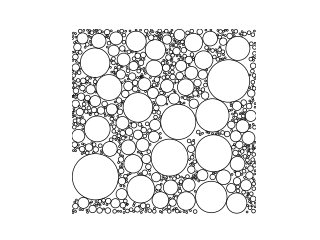

# Circle Packing

Data(`result.txt`) is generated using **C++** code(`circle_packing.cpp`) and it's plotted using **Python** code(`plot_circle_data.py` or faster `plot_circle_data_opencv.py`).

<!--  -->


- Took `20.8` seconds to generate `50000` circles.
- Took `0.893` seconds to draw `1634` of them.


- Took `76.9` seconds to generate `2063` circles.
- Took `0.801` seconds to draw `2063` of them.

## How to run

```bash
./build.sh
```

Images are generated in `images/` folder.
