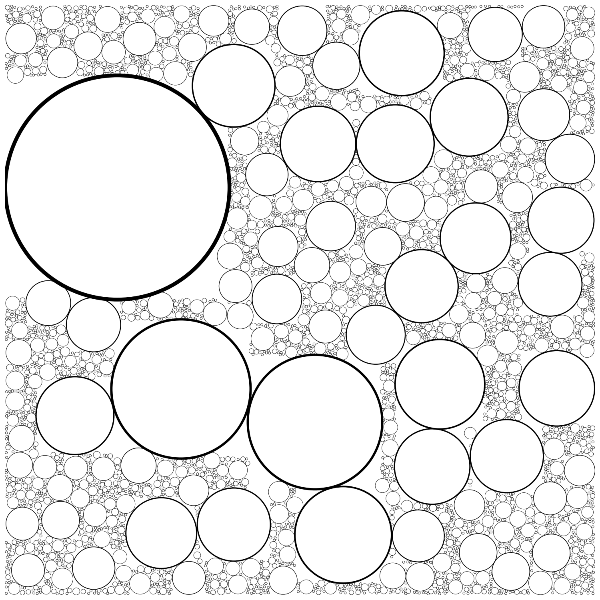

# Circle Packing

Data(`result.txt`) is generated using **C++** code(`circle_packing.cpp`) and it's plotted using **Python** code(`plot_circle_data.py`).

<!--  -->


- Took `6.7` seconds to generate `14000` circles.
- Took `11.9` seconds to draw `3398` of them.

## How to run

```bash
./build.sh
```

Images are generated in `images/` folder.
